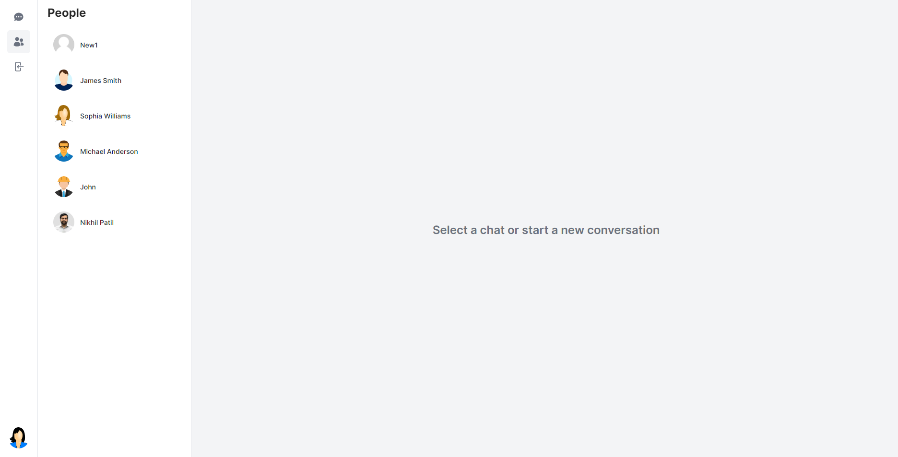

# Convo - A Facebook Messenger Clone

## Live Demo

Check out the live website: [Convo](https://convo-fawn.vercel.app)


## Table of Contents

1. [Project Overview](#project-overview)
2. [Features](#features)
3. [Tech Stack](#tech-stack)
4. [Demo](#demo)
5. [Installation and Setup](#installation-and-setup)
6. [Usage](#usage)
7. [Contributing](#contributing)
8. [License](#license)
9. [Contact](#contact)

## Project Overview

Convo is a feature-rich chat application designed to mimic the core functionalities of Facebook Messenger. Built using modern web technologies, Convo provides users with real-time messaging capabilities, media sharing options, and robust user management in a responsive and scalable platform.

## Features

- **Real-time Messaging:**
  - Instant text communication with real-time updates.
  - Typing indicators and message read receipts.
- **Media Sharing:**
  - Support for sharing images and videos.
- **User Status Indicators:**
  - Displays online/offline status and last active time of users.
- **User Authentication:**
  - Secure registration and login with JWT.
- **Profile Management:**
  - Update profile information and upload profile pictures.
- **Responsive Design:**
  - Optimized for both desktop and mobile devices.

## Tech Stack

- **Frontend:**
  - React.js, Redux, HTML5, CSS3, Tailwind CSS
- **Backend:**
  - Node.js, Express.js
- **Database:**
  - PostgreSQL, Prisma
- **Real-time Communication:**
  - Pusher
- **Authentication:**
  - NextAuth.js
- **Deployment:**
  - Vercel

## Demo

### Login Page


### Users Page


### Edit Profile Page


### Upload Images in Conversation Page


### Profile Details Page


### Group Feature


### Messages Page


## Installation and Setup

### Prerequisites

- Node.js
- PostgreSQL
- Pusher account (for real-time communication)

### Steps

1. **Clone the Repository:**
   ```bash
   git clone https://github.com/patilnikhil805/Convo.git
   cd Convo
   ```

2. **Install Dependencies:**
   ```bash
   npm install
   ```

3. **Set Up Environment Variables:**
   Create a `.env` file in the root directory and add the following variables:
   ```env
   DATABASE_URL=your_postgresql_connection_string
   PUSHER_APP_ID=your_pusher_app_id
   PUSHER_KEY=your_pusher_key
   PUSHER_SECRET=your_pusher_secret
   PUSHER_CLUSTER=your_pusher_cluster
   NEXTAUTH_URL=your_nextauth_url
   ```

4. **Run Database Migrations:**
   ```bash
   npx prisma migrate dev
   ```

5. **Start the Development Server:**
   ```bash
   npm run dev
   ```

6. **Access the Application:**
   Open your browser and navigate to `http://localhost:3000`.

## Usage

1. **Register an Account:**
   - Create a new account by providing your email and password.
2. **Login:**
   - Log in using your registered email and password.
3. **Start a Conversation:**
   - Search for users by their username or email and send them a message.
4. **Share Media:**
   - Click on the media icon in the chat window to share images and videos.
5. **Manage Profile:**
   - Update your profile information and upload a profile picture in the profile section.

## Contributing

We welcome contributions from the community to enhance Convo. To contribute, please follow these steps:

1. **Fork the Repository:**
   - Click on the "Fork" button on the top right of the repository page.
2. **Clone Your Fork:**
   ```bash
   git clone https://github.com/your_username/Convo.git
   cd Convo
   ```
3. **Create a New Branch:**
   ```bash
   git checkout -b feature/YourFeature
   ```
4. **Make Your Changes:**
   - Implement your feature or fix the bug.
5. **Commit Your Changes:**
   ```bash
   git commit -m 'Add feature/YourFeature'
   ```
6. **Push to Your Branch:**
   ```bash
   git push origin feature/YourFeature
   ```
7. **Open a Pull Request:**
   - Go to the original repository on GitHub and open a pull request from your forked repository.

Please ensure your code adheres to the project's coding standards and includes appropriate tests. Also, provide a clear description of your changes in the pull request.

## License

This project is licensed under the MIT License. See the [LICENSE](LICENSE) file for more details.

## Contact

If you have any questions, suggestions, or feedback, please feel free to reach out:

- **Nikhil Patil**
- GitHub: [patilnikhil805](https://github.com/patilnikhil805)
- Email: [pnikhil.805@gmail.com](mailto:pnikhil.805@gmail.com)
